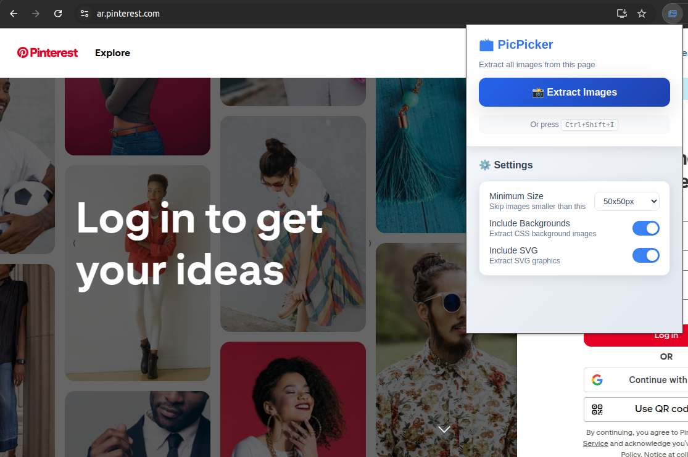
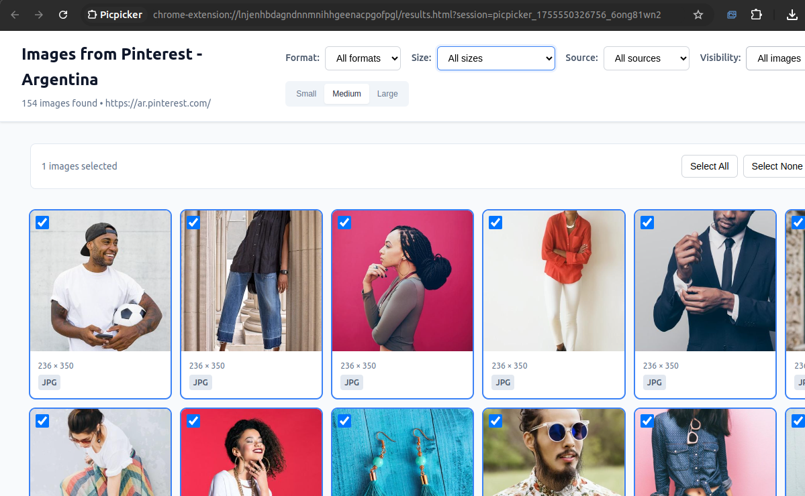
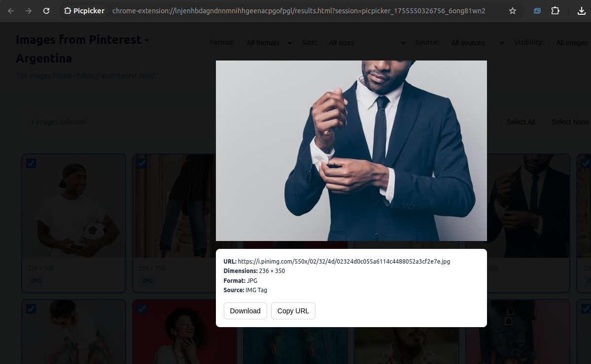

[](https://chromewebstore.google.com/detail/picpicker/mkiilhjbheleblbeegpbpnffkinapakn)
[](https://chromewebstore.google.com/detail/picpicker/mkiilhjbheleblbeegpbpnffkinapakn)
[](https://addons.mozilla.org/firefox/addon/picpicker/)
[](https://addons.mozilla.org/firefox/addon/picpicker/)
[](LICENSE)

# PicPicker - Universal Image Extractor

A powerful browser extension that extracts **all images** from any webpage with one click. Works universally on any website - no domain restrictions. Extract images from img tags, CSS backgrounds, SVG elements, video posters, and even lazy-loaded content.

## ✨ Key Features

🌐 **Universal** - Works on ANY website (Pinterest, Instagram, news sites, etc.)  
🔍 **Comprehensive** - Extracts from img tags, backgrounds, SVG, video posters, srcset, data-* attributes  
👁️ **Viewport Detection** - Shows which images were visible when extracted  
🎯 **Advanced Selection** - Shift+Click ranges, Ctrl+Click toggle, select all/none  
⚡ **Burst Downloads** - Download multiple selected images simultaneously  
🔍 **Text Search** - Search alt text when enabled  
⚙️ **Customizable** - Filter by size, format, source type, visibility  
🎨 **Modern UI** - Responsive grid, lightbox preview, hover tooltips  

## 🔒 Privacy-First Design

🛡️ **"On Click" Permissions** - Only runs when you explicitly activate it  
🚫 **No Background Monitoring** - Cannot read websites unless you click the extension  
📱 **Local Processing** - All image data stays in your browser  
🔐 **No Data Collection** - No analytics, tracking, or external servers  
⚡ **Instant Access** - No account required, works offline

## 📸 Screenshots

### One-Click Extraction
<p align="center">
  
</p>

*Single-click extraction with optimal default settings - no configuration needed*

### Image Grid Results
<p align="center">
  
</p>

*Responsive image grid with filtering, sorting, and bulk selection features*

### Lightbox Preview
<p align="center">
  
</p>

*Full-size image preview with metadata, download, and copy URL options*

## 🚀 Quick Start

### Installation
1. **[Chrome Web Store](https://chromewebstore.google.com/detail/picpicker/mkiilhjbheleblbeegpbpnffkinapakn)** - Chrome, Edge, and Chromium browsers
2. **[Mozilla Add-ons](https://addons.mozilla.org/firefox/addon/picpicker/)** - Firefox browser
3. Or build from source (see Development section)

### Usage
1. **Visit any website** with images (works everywhere!)
2. **Click the extension icon** or use `Ctrl+Shift+I`
3. **Extraction starts immediately** - opens new tab with all found images
4. **Filter, select, and download** - use the powerful grid interface

### Image Sources Supported
- 🖼️ **IMG tags** - Standard `` elements
- 🎨 **CSS Backgrounds** - `background-image` properties
- 🎭 **SVG Graphics** - Converted to downloadable formats
- 🎬 **Video Posters** - Thumbnail images from `<video poster="">`
- 📱 **Responsive Images** - `srcset` attributes with multiple resolutions
- 🔄 **Lazy Loading** - `data-src`, `data-original`, and 16+ data-* patterns
- 👁️ **Viewport Detection** - Tracks which images were visible during extraction

## 🛠️ Development

### Build from Source
```bash
# Clone and install dependencies
git clone https://github.com/flesler/picpicker
cd picpicker
npm install

# Run full test suite and build
npm run prepack
```

### Load in Chrome
1. Open `chrome://extensions/`
2. Enable "Developer mode"
3. Click "Load unpacked"
4. Select the `dist/` folder (NOT project root)

## 📁 Project Structure

```
src/
├── background.ts      # Service worker - tab management, session storage
├── content.ts         # DOM scanner - extracts images from any webpage
├── results.ts        # Results page - grid display, filtering, downloads
├── types.ts          # TypeScript interfaces for images and settings
├── utils.ts          # Shared utilities - logging, helpers
└── public/
    ├── manifest.json  # Extension manifest (universal domain support)
    ├── results.html   # Image grid results page
    └── icons/         # Extension icons (16px, 48px, 128px)
```

## 🛠️ Available Scripts

| Command | Description |
|---------|-------------|
| `npm run build` | Build optimized extension for Chrome |
| `npm run build:firefox` | Build for Firefox |
| `npm run prepack` | **Complete validation** - lint + type check + build + zip |
| `npm run lint:full` | TypeScript check + ESLint validation |
| `npm run lint:fix` | Auto-fix linting issues |

## 🏗️ Technical Architecture

### Privacy-First Permission Model
- **"activeTab" permissions** - Only access when user explicitly clicks
- **Dynamic injection** - Content script loaded only when needed
- **No persistent monitoring** - Cannot read websites in background
- **Session-based data** - Image data cleared when results tab closes

### Universal Domain Support
- **No restrictions** - Works on any website when activated
- **Cross-browser** - Chrome + Firefox support via webextension-polyfill
- **Manifest V3** - Modern service worker architecture

### Image Extraction Engine
- **DOM Scanner** - `querySelectorAll('*')` for comprehensive coverage
- **Multi-source** - IMG tags, CSS backgrounds, SVG, video posters
- **Advanced parsing** - srcset attributes, data-* lazy loading patterns
- **Performance optimized** - Short JSON keys, efficient filtering

### Data Flow Architecture
```
Content Script → Background → Results Tab
     ↓              ↓             ↓
DOM Scanning → Session Storage → Grid Display
```

- **In-memory sessions** - No persistent storage of image data
- **Message passing** - Avoids URL length limits for large datasets
- **One-time access** - Session deleted after results tab loads

## ⚙️ Settings & Features

### Extraction Settings
- **Optimal defaults** - 50px minimum, all source types enabled
- **Source Types** - IMG tags, backgrounds, SVG, video posters
- **Alt Text** - Enabled for search/tooltips
- **Performance** - 1000 images max per page, 10s timeout

### Results Features
- **Filtering** - Format, size, source type, viewport visibility
- **Text Search** - Alt text search (when enabled)
- **Selection Modes** - Click, Shift+Click ranges, Ctrl+Click toggle
- **Downloads** - Individual images or burst download multiple selections
- **Lightbox** - Full-size preview with metadata

### Keyboard Shortcuts
- `Ctrl+Shift+I` - Quick image extraction from any page

## 🔧 Development Features

### Modern TypeScript
- **Strict type checking** with webextension-polyfill types
- **Zero `any` types** - Comprehensive interface coverage
- **ES2022+ features** - Modern JavaScript with full browser support

### Build System
- **tsup + esbuild** - Fast, modern bundling with tree-shaking
- **Cross-browser builds** - Chrome/Firefox from single codebase
- **Dynamic manifest** - Version sync from package.json
- **Source maps** - Full debugging support in development

### Code Quality
- **ESLint + TypeScript** - Strict linting with custom rules
- **Consistent patterns** - DRY utilities, centralized logging
- **Performance focused** - Optimized JSON payloads, efficient DOM scanning

### Testing & Validation
- **Type safety** - Comprehensive interfaces prevent runtime errors
- **Lint validation** - `npm run lint:full` catches issues early
- **Build verification** - `npm run prepack` ensures release readiness

## 📄 License

MIT License - Feel free to fork and modify for your image extraction needs!
